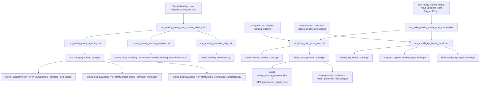

# Task Scheduler Dependency Map

This document explains what each Task Scheduler job runs and how data/artifacts flow across jobs.

## Scheduler To Command

- Weekly Monday issue category training set GET
  - Trigger: Weekly Monday
  - Entry: run_weekly_tuning_and_prepare_labeling.bat
- Daily bug category tuning CFE reminder
  - Trigger: Daily
  - Entry: run_labeling_reminder_daily.bat
- Analyze issue category human prediction
  - Trigger: Weekly Friday
  - Entry: run_friday_auto_close_loop.bat
- Run Friday to check IPS issue category tuning result
  - Trigger: Weekly Friday
  - Entry: run_weekly_kpi_health_check.bat
- Run Friday to send tuning result update to team
  - Trigger: Weekly Friday
  - Entry: run_friday_model_update_and_summary.bat
- Weekly JIRA VERIFY closure notification
  - Trigger: Weekly Monday
  - Entry: run_verify_issue_close_notify_weekly.bat
- Update HSD
  - Trigger: Daily
  - Entry: run_hsd_only.bat
- Daily issue loading notification
  - Trigger: Daily
  - Entry: run_offload_loading_summary_daily.bat
- CFE offload Arrangement
  - Trigger: TimeTrigger every 30 minutes
  - Entry: run_offload_reporter_issues_send_email_scheduler.bat
- 2026 overall loading per engineer
  - Trigger: Weekly Friday
  - Entry: run_weekly_current_yearly_issue_project_count.bat
- Monthly issue overview update
  - Trigger: Every 4 weeks on Friday
  - Entry: run_management_monthly_customer_issue_report.bat
- Wireless CE Weekly meeting summary
  - Trigger: Weekly Monday
  - Entry: external workspace bat (AI Project)

## Dataflow (Category Tuning)



## Dataflow (Offload / HSD / Other)

```mermaid
flowchart TD
  A1[Daily issue loading notification] --> B1[run_offload_loading_summary_daily.bat]
  B1 --> C1[run_offload_reporter_issues.bat --send-email --summary-only-email]

  D1[CFE offload Arrangement] --> E1[run_offload_reporter_issues_send_email_scheduler.bat]
  E1 --> F1[run_offload_reporter_issues.bat --send-email]

  G1[Update HSD] --> H1[run_hsd_only.bat]
  H1 --> I1[wireless_bug_dashboard_ips_hsd_jira.py --hsd-only]

  J1[Weekly JIRA VERIFY closure notification] --> K1[run_verify_issue_close_notify_weekly.bat]
  K1 --> L1[run_verify_issue_close_notify.bat --send-email]

  M1[2026 overall loading per engineer] --> N1[run_weekly_current_yearly_issue_project_count.bat]
  N1 --> O1[weekly_issue_count_report.py]
  N1 --> P1[weekly_project_loading_report.py]

  Q1[Monthly issue overview update] --> R1[run_management_monthly_customer_issue_report.bat]
  R1 --> S1[customer issue analysis/send_management_monthly_issue_report.py]

  T1[Wireless CE Weekly meeting summary] --> U1[AI Project/run_onenote_summary_email.bat (external workspace)]
```

## Operational Notes

- Main category loop has two schedulers touching similar outputs:
  - Monday generation and reminder (run_weekly_tuning_and_prepare_labeling.bat)
  - Friday analysis/promotion (run_friday_auto_close_loop.bat)
- run_friday_model_update_and_summary.bat is a wrapper that executes:
  - run_friday_auto_close_loop.bat
  - then run_weekly_kpi_health_check.bat
- Trigger confirmation:
  - `Run Friday to send tuning result update to team.xml` was re-exported and confirmed as Friday on 2026-06-03.
- Offload has two independent schedules:
  - daily summary email
  - every-30-min scheduler email/reassignment flow
- The meeting-summary task points outside this repo; portability depends on external path availability.
